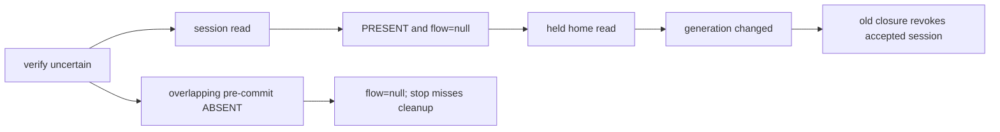
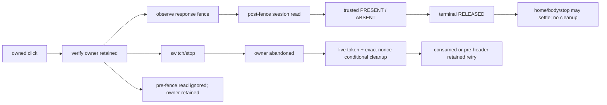

# Auth lifecycle state machine

The original model was frozen before the R7 product edits; this document includes the R8 v1.1 closure semantics. It separates user intent, session evidence, UI lifetime and conditional security cleanup. AuthClient adapts browser/Worker events to its production lifecycle controller; that controller is not the independent test oracle. View phase/sessionKnown remain presentation mirrors, not cleanup authority.

## Identity and knowledge

One user click owns a monotonically numbered click ID, account at click (or a single authorized initial connection), provider identity, originating generation and component lifetime. A new account/provider, explicit sign-out or stop cancels that click. A cancelled click cannot transfer to another wallet, ask personal_sign, verify or install a view session. When the click began with no account, an unchanged provider's event-free eth_accounts discovery may pin the first account. During an explicit initial grant, events remain provisional until its reply agrees with the latest event; only then is that one account pinned. A lock cancels even an unbound click. Queued old channel/provider/visibility callbacks carry their originating lifetime.

Session knowledge is a tagged union UNKNOWN / ABSENT / PRESENT(session). UNKNOWN never permits personal_sign. A validated signedIn:false proves ABSENT; explicit successful logout may also acknowledge absence. Only a valid address and positive safe-integer expiry prove PRESENT. Parse/transport/non-2xx/schema failures remain UNKNOWN. A definite verify refusal releases its owner and then reads the canonical session, rather than inventing absence from that error. House data is a separate read and cannot create or revoke server session authority.

Every explicit Sign In click dispatches a new canonical session GET after its own prior-operation wait. An earlier session GET, a shared restored ABSENT, or a channel message does not supply the click's receipt. The receipt pins click ID, read sequence, generation and life; its fresh ABSENT and current knowledge ABSENT gate challenge, personal_sign and verify. UNKNOWN/PRESENT invalidates an existing ABSENT receipt. Generation promotion inside the same valid click transfers its receipt explicitly; an external account/provider/life change cancels it instead. A newer ordinary read invalidates a receipt by read ordering; a valid superseding read permits at most one new per-click GET, never an automatic signature retry after failed/invalid/429/503 knowledge.

Matching canonical PRESENT restores home without a new challenge/signature/session. Mismatching PRESENT selects conditional expectedAddress cleanup, and its successful reply is followed by a new canonical GET in the same click. Only that GET's valid ABSENT allows challenge. Session acceptance and click receipt are committed before optional house I/O; house latency is not session authority. Waits are checked again after the click GET because finding ABSENT may make a formerly matching click depend on a still-outstanding cookie mutation.

## Cleanup ownership and causal fence

A verify dispatch creates exactly one responsibility record for that flow: nonce/account/click ID/generation/lifetime, dispatch read sequence, response fence, retained/released/consumed status and an in-flight cleanup flag. This record is retained by the operation itself, independent of the active UI generation. Before headers/transport settlement its commit may still happen; overlapping session reads cannot resolve it.

Record the latest sessionReadSeq when verify response headers become observable (or transport settles into recovery). Only a newer read, causally begun afterwards, may release this responsibility. A read merely newer than VERIFY_START may still predate commit and is not sufficient. Ordered recovery uses that same causal fence. A stale read is ignored; it cannot overwrite accepted post-verify knowledge or release the owner.

Trusted PRESENT (including a valid verify response for the current click) terminally RELEASES the responsibility **before** awaiting a house read. Trusted post-fence ABSENT also releases. Invalid reads retain it. A terminal record may remain for diagnostics/old closures, but has zero actionable cleanup ownership. No late home/body/restore/stop callback can revive RELEASED or CONSUMED.

Switch/stop/explicit cancellation marks an unresolved owner abandoned with its original cancellation reason. At most one request per owner is in flight. Each attempt captures whether the verify fence was observed **at dispatch**. An early refusal retains that owner even if the refusal is delivered after verify headers. When the fence arrives, or that in-flight early refusal completes, the same owner drains one later attempt. A successful cancellation, or completion of an attempt dispatched after response/transport observation, consumes the abandoned owner. Lock cancellation instead marks reconciliation-only; late headers/body/catch callbacks preserve that disposition and never silently become generic revoke. No guarantee is added for process termination/offline delivery.

The pure `planCleanup(reason, snapshot)` module selects one primary action before I/O. Pre-verify pending-only cancellation is local: the challenge may expire under the existing server deadline. With a displayed accepted session and pending challenge, the primary switch action is expectedAddress, and no competing pending-nonce POST is dispatched. A RELEASED/CONSUMED owner cannot suppress that address decision. A retained old A plus newer displayed B selects B's address as primary and keeps A's original operation responsibility; later A transport settlement is a separate, qualified owner event. Explicit /logout {} remains an intentional current-cookie action. Address assertions do not identify a particular session or grant server authority.

### Cleanup policy matrix

| Event | Validated displayed session | RETAINED verify owner | Pending click | Primary plan |
|---|---|---|---|---|
| stop/unmount | preserve accepted session | none/terminal | any | none / local cancel |
| stop/unmount | any | RETAINED | any | original expectedNonce |
| account/provider switch | present | any | any | displayed expectedAddress |
| account/provider switch | absent | RETAINED | any | original expectedNonce |
| account/provider switch | absent | none/terminal | pending | local cancel, natural expiry |
| wallet lock | accepted session | none/terminal | any | none / local cancel, preserve session |
| wallet lock | any | RETAINED | any | reconciliation-only after original response fence |
| explicit Logout | any | any | any | one intentional current-cookie logout |
| explicit Logout All | displayed assertion | any | any | expectedAddress plus unchanged server live-cookie gate |
| late cancelled verify | any | RETAINED | cancelled | owner settlement uses its original reason |

An earlier cleanup in flight does not suppress a new displayed-session context decision merely because its address is equal. Old nonce/address/explicit requests may have captured a different token even for the same address/expiry. Distinct lifecycle events can therefore own separate primary actions; the original verify owner's in-flight guard still prevents duplicate requests for that owner. The server's token/nonce checks decide what each request can revoke. A transient UNKNOWN does not destroy the validated identity of a still-displayed accepted session; expectedAddress remains only a conditional assertion backed by server cookie checks.

Each recorded event has one primary kind. This does not discard independently unsettled old verify responsibilities or imply one HTTP cleanup for the entire application lifetime. One original owner can have its existing bounded post-fence retry, and distinct legitimate owners across lifetimes can exist. Terminal owners never resurrect.

When a causal PRESENT releases the current verify owner, the active lifetime may emit at most one local signed-in hint for that operation, before awaiting its home read or a stalled verify body. Later completion cannot duplicate the emitter's announcement. Receiver correctness does not depend on delivery: hints only request canonical rereads, and every next explicit click performs its own GET. Ordinary restore reads do not create a new click. One click/nonce has at most one signature/accepted creation; a GET is not a cross-tab atomic lock, so two independent clicks that both read ABSENT are not claimed to share a globally unique sign-in intent.

Detached cleanup completion cannot install an old session, clear a restarted view directly or broadcast through the stopped channel. It signals a currently started lifetime to invalidate its home/session knowledge and read the canonical cookie. This request waits while a click, non-idle phase or explicit sign-out is busy; synchronous acceptance and its signed-in announcement finish before the queued read drains. A fully stopped client performs no read, notification or timer update. A restarted client may perform a fresh read even after a conditional refusal, because cleanup completion is not itself canonical session knowledge.

## Transition table

| From | Event | To | Cleanup responsibility | personal_sign allowed |
|---|---|---|---|---|
| IDLE_UNKNOWN | sign click | PREFLIGHT_READING_SESSION | prior unresolved owner unchanged | No |
| IDLE_ABSENT/PRESENT | sign click | PREFLIGHT_READING_SESSION | none / prior owner unchanged | No |
| PREFLIGHT | valid causal ABSENT | CHALLENGE_REQUESTED | none | Not yet |
| PREFLIGHT | valid PRESENT for account | PRESENT_ACCEPTED | release causal owner | No; refresh home |
| PREFLIGHT | invalid/429/503 read | IDLE_UNKNOWN | retain owner | No |
| PREFLIGHT | account/provider/stop | IDLE_UNKNOWN/STOPPED | cancel original click; do not plain logout | No |
| CHALLENGE_REQUESTED | valid checked SIWE | CHALLENGE_READY | capture nonce for pending cancellation | Not yet |
| CHALLENGE_READY | same click/account/provider/generation | SIGNATURE_PROMPTING | same click | Yes, once |
| SIGNATURE_PROMPTING | signature OK and same ownership | VERIFY_IN_FLIGHT | create one retained verify owner | No additional prompt |
| VERIFY_IN_FLIGHT | old/pre-commit session read arrives | VERIFY_IN_FLIGHT | retain; do not accept as resolution | No |
| VERIFY_IN_FLIGHT | response observed, body unreadable | VERIFY_COMMITTED_UNCERTAIN -> VERIFY_RECONCILING | retained, record response fence | No |
| VERIFY_IN_FLIGHT | valid expected verify body | PRESENT_ACCEPTED | release before home read | No |
| VERIFY_RECONCILING | causal valid PRESENT | PRESENT_ACCEPTED | terminal release before home read | No |
| VERIFY_RECONCILING | causal valid ABSENT | IDLE_ABSENT | terminal release | Later new click only |
| VERIFY_RECONCILING | invalid read | IDLE_UNKNOWN | retained | No |
| retained owner | switch/stop | ABANDONED_CLEANUP_PENDING / STOPPED | planner selects one primary authority | No |
| retained owner | lock | VERIFY_RECONCILING | original owner retained until post-fence valid read; no revoke | No |
| abandoned owner | early refusal while verify pending | same | retained, retry only after response fence | No |
| abandoned owner | successful cancellation or post-fence-dispatched attempt completes | cancelled idle / STOPPED | consumed best effort | No |
| PRESENT_ACCEPTED | stop / old home/body completion | STOPPED / unchanged accepted knowledge | none; never abandoned logout | No |
| PRESENT_ACCEPTED | wallet/provider switch | idle / canonical restore | independent displayed-address decision, never reuse terminal nonce | No |
| PRESENT_ACCEPTED | wallet lock | accepted session retained | no abandoned cleanup | No |
| STOPPED | restart | idle knowledge / canonical restore | old owner stays detached from new UI | No implicit click |
| detached cleanup | completion after restart | current-life canonical restore when idle | no stale UI result installation | No implicit click |

## Lock and clock policy

Locking a wallet cancels an active click and clears the wallet-visible account, while preserving an accepted session. A retained uncertain verify owner is reconciliation-only, including an UNKNOWN-idle owner. A pre-response ABSENT cannot release it. After its response/transport fence, a new canonical valid PRESENT or ABSENT releases its original responsibility; invalid/failed reads retain it. Lock before headers, lock while body is stalled, and late body/throw paths follow the same rule. A later explicit switch/stop/sign-out is a different event and may supersede lock with its documented cleanup disposition.

Client cache ages use the shared finite helper: finite now/stamp/positive TTL and `0 <= now - stamp < ttl`. Negative or non-finite session-read age triggers refresh; invalid home age cannot suppress scheduled home refresh; invalid last-success age cannot preserve owner proof after a refused check. The deadline is exclusive, including the exact three-minute stale-house boundary. These guards do not mix performance.now with remote epoch values or change server session expiry/message timestamp authority. No monotonic-clock implementation is claimed by this helper.

## Before and after

Before, view generation and a closure nonce could independently cause cleanup after a valid read had discarded flow responsibility:

After, operation identity and causal knowledge determine security decisions; UI staleness alone does not:

## Server and retained boundaries

Conditional nonce revocation requires token+nonce+revoked_at IS NULL+expires_at>now. A missing/forged/dead/mismatched token changes no row/challenge/cookie. Any token forbids pending-only fallback. Without a token, only the original flow cookie and exact pending/unexpired nonce permit cancelling that challenge. No newer row, pending challenge or flow cookie is selected by old ownership.

R4-01 logout-all retains live cookie/address equality. House authority remains session address + Ethereum mainnet ownerOf + eligibility. Wallet methods remain eth_accounts / eth_requestAccounts / exact SIWE personal_sign. No new transactions or signing capabilities.

Remaining limitations: auth fetch has no newly added bounded deadline; process/offline cleanup is best effort; lost A token cannot authorize A revocation after B replaces it; expectedAddress cannot distinguish same-wallet renewal; an already authorized live-request cookie clear can arrive late and remove a newer browser cookie without revoking its row. Full browser/production concurrency/deployment correspondence and independent closure remain separate gates. R8 fixture results are recorded in R8_AUTH_REMEDIATION.md; they are not WORLD_SECURITY_BASELINE_v1 certification.

Diagnostic API: AuthClient.lifecycleSnapshot is a copied getter exposing logical state, knowledge, current click's safe receipt metadata, latest owner status/read fence/cancellation reason, retainedCount, and the last 64 primary plan entries (event ID/reason/kind/optional flow ID). It contains no provider objects, signature, nonce, cookie or token. Terminal records retained by old operations have no actionable ownership. AuthState phase/sessionKnown are presentation mirrors; busy is derived from the controller's current click, and UI generation is not cleanup authority.
