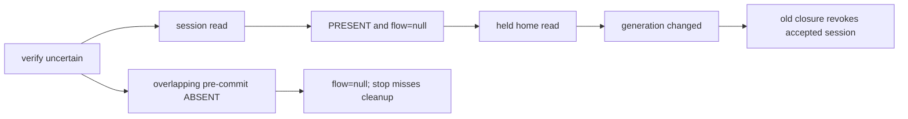
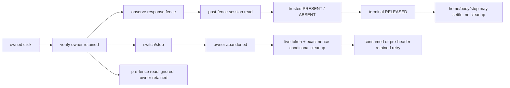

# Auth lifecycle state machine

Design frozen before the R7 product edits. This model separates user intent, session evidence, UI lifetime and conditional security cleanup. AuthClient adapts browser/Worker events to an independent controller; view phase/sessionKnown remain presentation mirrors, not cleanup authority.

## Identity and knowledge

One user click owns a monotonically numbered click ID, account at click (or a single authorized initial connection), provider identity, originating generation and component lifetime. A new account/provider, explicit sign-out or stop cancels that click. A cancelled click cannot transfer to another wallet, ask personal_sign, verify or install a view session. When the click began with no account, an unchanged provider's event-free eth_accounts discovery may pin the first account. During an explicit initial grant, events remain provisional until its reply agrees with the latest event; only then is that one account pinned. A lock cancels even an unbound click. Queued old channel/provider/visibility callbacks carry their originating lifetime.

Session knowledge is a tagged union UNKNOWN / ABSENT / PRESENT(session). UNKNOWN never permits personal_sign. A validated signedIn:false proves ABSENT; explicit successful logout may also acknowledge absence. Only a valid address and positive safe-integer expiry prove PRESENT. Parse/transport/non-2xx/schema failures remain UNKNOWN. A definite verify refusal releases its owner and then reads the canonical session, rather than inventing absence from that error. House data is a separate read and cannot create or revoke server session authority.

## Cleanup ownership and causal fence

A verify dispatch creates exactly one responsibility record for that flow: nonce/account/click ID/generation/lifetime, dispatch read sequence, response fence, retained/released/consumed status and an in-flight cleanup flag. This record is retained by the operation itself, independent of the active UI generation. Before headers/transport settlement its commit may still happen; overlapping session reads cannot resolve it.

Record the latest sessionReadSeq when verify response headers become observable (or transport settles into recovery). Only a newer read, causally begun afterwards, may release this responsibility. A read merely newer than VERIFY_START may still predate commit and is not sufficient. Ordered recovery uses that same causal fence. A stale read is ignored; it cannot overwrite accepted post-verify knowledge or release the owner.

Trusted PRESENT (including a valid verify response for the current click) terminally RELEASES the responsibility **before** awaiting a house read. Trusted post-fence ABSENT also releases. Invalid reads retain it. A terminal record may remain for diagnostics/old closures, but has zero actionable cleanup ownership. No late home/body/restore/stop callback can revive RELEASED or CONSUMED.

Cancellation marks an unresolved owner abandoned and asks conditional cleanup. At most one request per owner is in flight. Each attempt captures whether the verify fence was observed **at dispatch**. An early refusal retains that owner even if the refusal is delivered after verify headers. When the fence arrives, or that in-flight early refusal completes, the same owner drains one later attempt. A successful cancellation, or completion of an attempt dispatched after response/transport observation, consumes the abandoned owner. This is one owner, not two competing closures; no guarantee is added for process termination/offline delivery.

Pre-verify challenge cancellation uses only its captured nonce, never the current shared flow cookie as an identity. A new wallet switch may separately clean a displayed session by expectedAddress; that is a new context-consistency decision, not revival of a released verify owner. Explicit /logout {} remains an intentional current-cookie action.

## Transition table

| From | Event | To | Cleanup responsibility | personal_sign allowed |
|---|---|---|---|---|
| IDLE_UNKNOWN | sign click | PREFLIGHT_READING_SESSION | prior unresolved owner unchanged | No |
| IDLE_ABSENT/PRESENT | sign click | PREFLIGHT_READING_SESSION | none / prior owner unchanged | No |
| PREFLIGHT | valid causal ABSENT | CHALLENGE_REQUESTED | none | Not yet |
| PREFLIGHT | valid PRESENT for account | PRESENT_ACCEPTED | release causal owner | No; refresh home |
| PREFLIGHT | invalid/429/503 read | IDLE_UNKNOWN | retain owner | No |
| PREFLIGHT | account/provider/stop | IDLE_UNKNOWN/STOPPED | cancel original click; do not plain logout | No |
| CHALLENGE_REQUESTED | valid checked SIWE | CHALLENGE_READY | capture nonce for pending cancellation | Not yet |
| CHALLENGE_READY | same click/account/provider/generation | SIGNATURE_PROMPTING | same click | Yes, once |
| SIGNATURE_PROMPTING | signature OK and same ownership | VERIFY_IN_FLIGHT | create one retained verify owner | No additional prompt |
| VERIFY_IN_FLIGHT | old/pre-commit session read arrives | VERIFY_IN_FLIGHT | retain; do not accept as resolution | No |
| VERIFY_IN_FLIGHT | response observed, body unreadable | VERIFY_COMMITTED_UNCERTAIN -> VERIFY_RECONCILING | retained, record response fence | No |
| VERIFY_IN_FLIGHT | valid expected verify body | PRESENT_ACCEPTED | release before home read | No |
| VERIFY_RECONCILING | causal valid PRESENT | PRESENT_ACCEPTED | terminal release before home read | No |
| VERIFY_RECONCILING | causal valid ABSENT | IDLE_ABSENT | terminal release | Later new click only |
| VERIFY_RECONCILING | invalid read | IDLE_UNKNOWN | retained | No |
| retained owner | switch/stop | ABANDONED_CLEANUP_PENDING / STOPPED | one conditional owner/request | No |
| abandoned owner | early refusal while verify pending | same | retained, retry only after response fence | No |
| abandoned owner | successful cancellation or post-fence-dispatched attempt completes | cancelled idle / STOPPED | consumed best effort | No |
| PRESENT_ACCEPTED | stop / old home/body completion | STOPPED / unchanged accepted knowledge | none; never abandoned logout | No |
| STOPPED | restart | idle knowledge / canonical restore | old owner stays detached from new UI | No implicit click |

## Before and after

Before, view generation and a closure nonce could independently cause cleanup after a valid read had discarded flow responsibility:

After, operation identity and causal knowledge determine security decisions; UI staleness alone does not:

## Server and retained boundaries

Conditional nonce revocation requires token+nonce+revoked_at IS NULL+expires_at>now. A missing/forged/dead/mismatched token changes no row/challenge/cookie. Any token forbids pending-only fallback. Without a token, only the original flow cookie and exact pending/unexpired nonce permit cancelling that challenge. No newer row, pending challenge or flow cookie is selected by old ownership.

R4-01 logout-all retains live cookie/address equality. House authority remains session address + Ethereum mainnet ownerOf + eligibility. Wallet methods remain eth_accounts / eth_requestAccounts / exact SIWE personal_sign. No new transactions or signing capabilities.

Remaining limitations: auth fetch has no newly added bounded deadline; process/offline cleanup is best effort; lost A token cannot authorize A revocation after B replaces it; expectedAddress cannot distinguish same-wallet renewal; an already authorized live-request cookie clear can arrive late and remove a newer browser cookie without revoking its row. Full browser/production concurrency/deployment correspondence and independent R7 closure remain separate gates. This document is implementation design, not WORLD_SECURITY_BASELINE_v1 certification.

Diagnostic API: AuthClient.lifecycleSnapshot is a copied read-only getter exposing logical state, knowledge, current click, latest owner status/read fence and retainedCount. It contains no provider objects, signature, nonce, cookie or token. Terminal records retained by old operations have no actionable ownership. AuthState phase/sessionKnown are presentation mirrors; busy is derived from the controller's current click, and UI generation is not cleanup authority.
